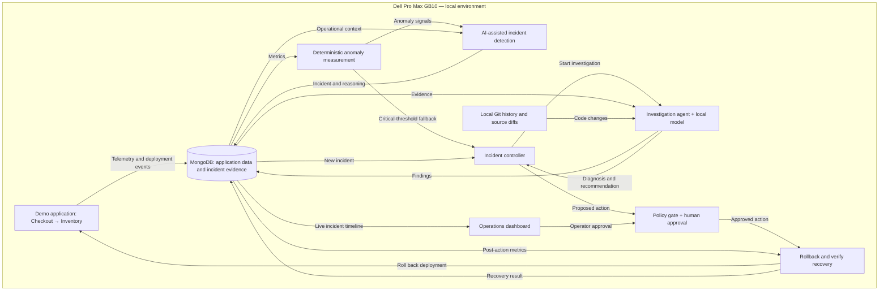

# Blackbox

**Local incident response, from detection to verified recovery.**

Blackbox is a hackathon project for an autonomous site reliability engineering (SRE) agent. It is designed to detect incidents, investigate telemetry and source changes, recommend controlled remediation, and verify recovery. AI inference and sensitive operational data stay on the Dell Pro Max GB10.

**Status:** The repository currently contains backend and frontend scaffolding. The architecture below describes the planned MVP.

## Why Blackbox

Incident response means connecting evidence scattered across monitoring tools, deployment history, and source code. Blackbox brings that investigation into one local workflow, with an evidence-backed diagnosis and a visible record of the incident, action, and recovery.

## Architecture

- **Demo application:** Checkout calls Inventory, backed by MongoDB. A deliberately bad deployment creates a reproducible latency regression.
- **MongoDB:** The shared record for telemetry, deployments, incidents, investigation evidence, and remediation history, alongside the demo application's data.
- **Detection:** Deterministic rules measure deviations from baseline. AI correlates anomaly signals with deployments, logs, traces, and related anomalies to identify real incidents, suppress likely noise, and record its reasoning. Decisions use bounded inputs and structured outputs, with deterministic thresholds as a fallback for critical conditions.
- **Controller and investigation agent:** The controller starts investigations and coordinates the incident lifecycle. The agent connects telemetry with local Git history and source diffs to produce a diagnosis and remediation recommendation. The planned runtime is OpenClaw, managed through NemoClaw with OpenShell for constrained execution and a local model on the GB10.
- **Remediation:** A deterministic policy gate validates the proposed action and requires human approval for the MVP. The controller executes the rollback and checks fresh telemetry before resolving the incident.
- **Dashboard:** Shows service health, investigation evidence, the recommended action, approval controls, and verified recovery.

## Demo flow

1. Start with healthy checkout and inventory services.
2. Deploy an inventory change that replaces a bulk database query with repeated individual queries, causing latency to rise.
3. Deterministic monitoring emits an anomaly signal. AI correlates it with operational context and records an incident.
4. Blackbox investigates the deployment and source diff, identifies the query regression, and recommends a rollback with supporting evidence.
5. An operator approves the rollback. Blackbox executes it, verifies that latency returns to baseline, and closes the incident.

The MVP focuses on one complete loop: **detect → investigate → diagnose → remediate → verify**.

## Repository

- [`backend/`](backend/) — backend scaffold.
- [`frontend/`](frontend/) — frontend scaffold.

Setup and run instructions will be added as the implementation lands.
